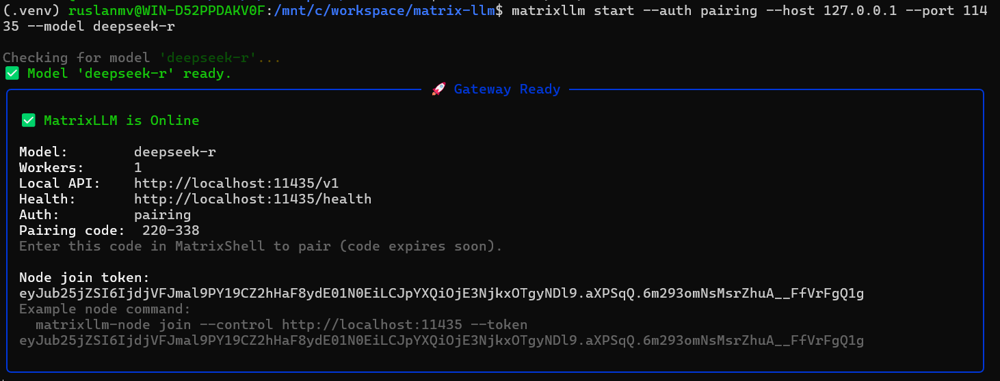
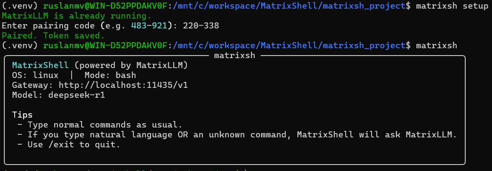
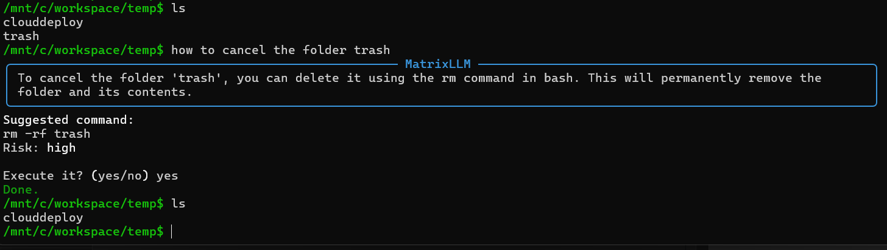

<p align="center">
  
</p>

<p align="center">
  <strong>Turn your terminal into a safe, AI-assisted shell</strong>
</p>

<p align="center">
  <a href="#features">Features</a> •
  <a href="#quick-start">Quick Start</a> •
  <a href="#usage">Usage</a> •
  <a href="#how-it-works">How It Works</a> •
  <a href="#configuration">Configuration</a> •
  <a href="#security">Security</a> •
  <a href="docs/FAQ.md">FAQ</a>
</p>

<p align="center">
  
  
  
</p>


---

Type normal commands as usual.
Type **natural language** (any language) and MatrixShell suggests the right command, explains it, and runs it **only with your confirmation**.

```text
/home/user/projects$ come posso cancellare questa cartella

╭─────────────────────────────────── MatrixLLM ───────────────────────────────────╮
│ Per cancellare la cartella, usa questo comando:                                 │
│                                                                                 │
│     rm -rf "BOT-MMORPG-AI-DEV"                                                  │
│                                                                                 │
│ Questo eliminerà tutti i file definitivamente.                                  │
╰─────────────────────────────────────────────────────────────────────────────────╯
Suggested command:
rm -rf "BOT-MMORPG-AI-DEV"
Risk: high

Execute it? (yes/no)
```


---

## Features

- **Natural Language to Commands** — Describe what you want in plain English, Italian, Spanish, or any language
- **Smart Command Detection** — Automatically detects whether input is a command or natural language
- **Risk Assessment** — Every suggested command shows a risk level (low/medium/high)
- **Hard Safety Limits** — Dangerous operations (disk formatting, mass deletions) are blocked by default
- **Cross-Platform** — Works on Windows (CMD/PowerShell), macOS, and Linux (Bash)
- **One-Command Setup** — `matrixsh setup` handles everything automatically
- **Secure Pairing** — Local-only pairing mode ensures credentials stay on your machine
- **Context-Aware** — Maintains command history per directory for smarter suggestions

---

## Requirements

- **Python 3.9+**
- **MatrixLLM** — AI gateway (auto-installed by `matrixsh setup`)
- **uv** or **pipx** — For installing Python CLI tools (recommended)

---

## Installation

### Option A: Using pipx (Recommended)

**macOS / Linux / WSL**

```bash
python3 -m pip install --user pipx
python3 -m pipx ensurepath
pipx install matrixsh
```

**Windows PowerShell**

```powershell
python -m pip install --user pipx
python -m pipx ensurepath
pipx install matrixsh
```

### Option B: Using uv

```bash
curl -LsSf https://astral.sh/uv/install.sh | sh
uv tool install matrixsh
```

### Option C: From Source (Dev Mode)

```bash
git clone https://github.com/agent-matrix/MatrixShell.git
cd MatrixShell
pip install -e .
```

---

## Quick Start

### 1) One-Command Setup

```bash
matrixsh setup
```

What it does:

- Ensures MatrixLLM is installed (auto-installs via `uv` or `pipx` if missing)
- Starts MatrixLLM locally in **pairing mode** on `127.0.0.1:11435`
- Prompts for a short pairing code (e.g., `483-921`)
- Stores a token so future runs are automatic

### 2) Run MatrixShell

```bash
matrixsh
```

That's it! You're ready to go.

---

## Usage

### Normal Commands (Pass-Through)

```bash
matrixsh
/home/user$ ls -la
/home/user$ cd projects
/home/user/projects$ git status
/home/user/projects$ docker ps
```

MatrixShell runs these commands normally and prints output. No AI involved.

### Natural Language Queries

Type what you want to do in any language:

**English:**
```
/home/user$ how can I find the biggest files here?
```

**Italian:**
```
C:\Users\rusla\temp> come posso cancellare questa cartella
```

**Spanish:**
```
/home/user$ cómo puedo ver los procesos que usan más memoria
```

MatrixShell detects natural language, asks MatrixLLM, and shows:

```
╭─────────────────────────────────── MatrixLLM ───────────────────────────────────╮
│ To find the biggest files, use this command which shows the top 20 largest:     │
╰─────────────────────────────────────────────────────────────────────────────────╯
Suggested command:
du -ah . | sort -hr | head -n 20
Risk: low

Execute it? (yes/no)
```

### Handling "Command Not Found"

If you type a word that isn't a command:

```bash
/home/user$ hello
bash: hello: command not found
```

MatrixShell automatically switches to AI help and may suggest:

```bash
echo "Hello!"
```

### Shell Modes

Force a specific shell mode:

```bash
matrixsh --mode powershell   # Windows PowerShell
matrixsh --mode cmd          # Windows CMD
matrixsh --mode bash         # Linux/macOS Bash
matrixsh --mode auto         # Auto-detect (default)
```

### Exit

```
/exit
```

---

## How It Works

### Step-by-Step Flow

```
┌─────────────────────────────────────────────────────────────────────────────────┐
│                              MatrixShell Flow                                   │
├─────────────────────────────────────────────────────────────────────────────────┤
│                                                                                 │
│   User Input                                                                    │
│       │                                                                         │
│       ▼                                                                         │
│   ┌───────────────────┐                                                         │
│   │ Is it a command?  │──── Yes ────▶ Execute directly ──▶ Show output          │
│   └───────────────────┘                                                         │
│       │ No / Failed                                                             │
│       ▼                                                                         │
│   ┌───────────────────┐                                                         │
│   │ Natural language  │                                                         │
│   │ or cmd not found  │                                                         │
│   └───────────────────┘                                                         │
│       │                                                                         │
│       ▼                                                                         │
│   ┌───────────────────┐      ┌─────────────────────────────────┐                │
│   │ Gather context:   │      │ MatrixLLM responds with:        │                │
│   │ • OS + shell      │─────▶│ • explanation                   │                │
│   │ • current dir     │      │ • suggested command             │                │
│   │ • file list       │      │ • risk level (low/medium/high)  │                │
│   │ • recent history  │      └─────────────────────────────────┘                │
│   └───────────────────┘                    │                                    │
│                                            ▼                                    │
│                               ┌───────────────────────┐                         │
│                               │ Show suggestion       │                         │
│                               │ Ask: Execute? (y/n)   │                         │
│                               └───────────────────────┘                         │
│                                            │                                    │
│                          ┌─────────────────┴─────────────────┐                  │
│                          │                                   │                  │
│                         Yes                                 No                  │
│                          │                                   │                  │
│                          ▼                                   ▼                  │
│                   ┌─────────────┐                    ┌──────────────┐           │
│                   │ Check       │                    │ Cancelled.   │           │
│                   │ denylist    │                    └──────────────┘           │
│                   └─────────────┘                                               │
│                          │                                                      │
│              ┌───────────┴───────────┐                                          │
│              │                       │                                          │
│           Allowed                 Denied                                        │
│              │                       │                                          │
│              ▼                       ▼                                          │
│       ┌─────────────┐      ┌─────────────────────┐                              │
│       │ Execute     │      │ Refusing to execute │                              │
│       │ Show output │      │ (safety denylist)   │                              │
│       └─────────────┘      └─────────────────────┘                              │
│                                                                                 │
└─────────────────────────────────────────────────────────────────────────────────┘
```

### 1) Smart Wrapper Shell

MatrixShell is not a plugin that modifies CMD/PowerShell/bash.
Instead, it runs its **own interactive loop**:

- Shows a normal prompt (like `C:\...>` or `/home/...$`)
- Reads what you type
- Decides what to do next

### 2) Tries Normal Commands First

If you type a real command (`dir`, `ls`, `cd`, `git status`, `python --version`), MatrixShell executes it using the selected shell mode:

- **Windows**: PowerShell by default (or CMD if you choose)
- **Linux/macOS/WSL**: Bash

If the command succeeds, it just prints output. No AI needed.

### 3) Detects Natural Language or "Command Not Found"

If you type something like:

- "come posso cancellare questa cartella?"
- "how do I find big files?"
- "why is port 11435 busy?"

Or you type a command that fails with "command not found", MatrixShell switches into **AI fallback mode**.

### 4) Sends Context to MatrixLLM

MatrixShell gathers helpful context:

- OS + shell mode
- Current directory
- List of files/folders in the directory
- Your last few messages (history per directory)

Then it calls MatrixLLM's endpoint: `POST /v1/chat/completions`

MatrixLLM responds with **structured JSON**:

```json
{
  "explanation": "...",
  "command": "...",
  "risk": "low|medium|high"
}
```

### 5) Shows Suggestion and Asks Permission

MatrixShell prints:

- Explanation (in your language)
- Suggested command
- Risk level

Then asks:

```
Execute it? (yes/no)
```

**Only if you answer yes**, it runs the command.

---

## Configuration

### Config File Location

| Platform | Path |
|----------|------|
| Linux/macOS/WSL | `~/.config/matrixsh/config.json` |
| Windows | `%APPDATA%\matrixsh\config.json` |

### Config File Format

```json
{
  "base_url": "http://localhost:11435/v1",
  "api_key": "",
  "token": "mtx_abc123...",
  "model": "deepseek-r1",
  "timeout_s": 120
}
```

### Environment Variables

Environment variables override config file settings:

| Variable | Description |
|----------|-------------|
| `MATRIXLLM_BASE_URL` | Gateway URL |
| `MATRIXSH_BASE_URL` | Alternative to above |
| `MATRIXLLM_API_KEY` | API key for authentication |
| `MATRIXSH_API_KEY` | Alternative to above |
| `MATRIXSH_TOKEN` | Pairing token (takes priority) |
| `MATRIXLLM_MODEL` | Model name |
| `MATRIXSH_MODEL` | Alternative to above |

### Priority Order

1. Command-line arguments (`--url`, `--key`, etc.)
2. Environment variables
3. Config file
4. Built-in defaults

---

## Commands Reference

| Command | Description |
|---------|-------------|
| `matrixsh` | Start interactive shell |
| `matrixsh setup` | One-command setup (install, start, pair) |
| `matrixsh install` | Write config and test gateway connection |
| `/exit` or `/quit` | Exit MatrixShell (inside the shell) |

### Setup Options

```bash
matrixsh setup --port 8080           # Custom port
matrixsh setup --model gpt-4         # Custom model
matrixsh setup --url http://...      # Custom URL (local only)
```

### Install Options

```bash
matrixsh install --url https://api.example.com/v1 --key "sk-..."
matrixsh install --token "mtx_..."
matrixsh install --model gpt-4
```

### Runtime Options

```bash
matrixsh --no-healthcheck            # Skip health check
matrixsh --stream                    # Enable streaming
matrixsh --url ... --model ... --key ...  # Override for session
```

---

## Security

### Confirmation Before Execution

MatrixShell **always** asks:

```
Execute it? (yes/no)
```

Nothing runs without your explicit approval.

### Hard Denylist

MatrixShell refuses to execute system-critical commands, even if you type "yes":

| Platform | Blocked Commands |
|----------|-----------------|
| **Windows** | `format`, `diskpart`, `bcdedit`, registry modifications |
| **Linux/macOS** | `mkfs.*`, `dd if=...`, `fdisk`, `parted` |
| **All** | `shutdown`, `reboot`, `init 0` |

You can still copy/paste manually if you truly intend it.

### Pairing Mode Security

- **Local-Only** — Pairing only works with `localhost`, `127.0.0.1`, or `::1`
- **One-Time Code** — 6-digit codes expire quickly
- **Token-Based Auth** — After pairing, a token (`mtx_...`) is saved locally
- **No Network Exposure** — Gateway binds to `127.0.0.1` by default

### Remote Gateways

For remote MatrixLLM instances, pairing is **disabled** for security.
Use API keys instead:

```bash
matrixsh install --url https://api.example.com/v1 --key "sk-..."
```

---

## What MatrixShell Sends to the Model

MatrixShell only sends lightweight context:

- Current directory path
- A list of file/folder names (not file contents)
- Your input and short local history

It does **not** read or upload your files unless you explicitly command it to (e.g., `cat file.txt`).

---

## Troubleshooting

### MatrixLLM Not Running

```
MatrixLLM not running. Start it now? [Y/n]
```

Press Enter to start automatically, or run:

```bash
matrixsh setup
```

### Unauthorized (401)

```
Unauthorized (401). MatrixLLM requires credentials.
```

**Solutions:**
- Local: `matrixsh setup`
- Remote: `matrixsh install --key "sk-..."`

### Pairing Not Enabled

```
Pairing is not enabled on this MatrixLLM instance.
```

Restart MatrixLLM with pairing:

```bash
matrixllm start --auth pairing --host 127.0.0.1 --port 11435
```

### WSL Can't Reach localhost

In most WSL2 setups, `localhost` works. If not:

- Try `http://127.0.0.1:11435/v1`
- Verify Windows firewall rules
- Ensure MatrixLLM is bound correctly

---

### 🚀 Quick Start Demo

Follow these steps to start the AI gateway and run your first natural language command.

#### 1. Start the Local AI Gateway

First, launch the **MatrixLLM** backend. This starts the server in pairing mode on your local machine using the `deepseek-r` model.

```bash
matrixllm start --auth pairing --host 127.0.0.1 --port 11435 --model deepseek-r

```


#### 2. Configure the Shell

Open a **new terminal window** (keep the previous one running). Run the setup command to pair the shell with the gateway using the code displayed in step 1.

```bash
matrixsh setup

```

#### 3. Launch MatrixShell

Once setup is complete, enter the interactive shell environment.

```bash
matrixsh

```

#### 4. Execute a Natural Language Command

Type your request in plain language. For example, to delete a folder named "trash":

**User Input:**

> how to cancel the folder trash

**MatrixShell Response:**
The AI proposes the correct command (`rm -rf trash`) and waits for your confirmation.

```text
Risk: High
Execute it? (yes/no) yes

```

**Result:**
The command is executed safely.




---

## New in v0.1.1: MCP Server Catalog & Plugin System

MatrixShell now supports connecting to external MCP (Model Context Protocol) servers through a powerful plugin system and catalog integration.

### MCP Server Catalog

Connect to an MCP server catalog (like [ContextForge](https://github.com/IBM/mcp-context-forge)) to discover and use external tools:

```bash
# Login to a catalog
matrixsh login --url http://localhost:4444 --token <JWT>

# List available servers
matrixsh servers

# Enable a server
matrixsh enable github

# List all tools from enabled servers
matrixsh tools

# Sync enabled servers to local plugins
matrixsh sync

# Check status
matrixsh status
```

### Plugin System

Manage external MCP servers as plugins:

```bash
# List configured plugins
matrixsh plugins

# Add a plugin manually
matrixsh plugin add --id github --name "GitHub MCP" \
  --transport streamable-http \
  --url http://localhost:4444/servers/github/mcp

# Enable/disable plugins
matrixsh plugin enable github
matrixsh plugin disable github

# Remove a plugin
matrixsh plugin remove github
```

### Catalog Commands Reference

| Command | Description |
|---------|-------------|
| `matrixsh login` | Login to MCP server catalog |
| `matrixsh logout` | Logout from catalog |
| `matrixsh status` | Show comprehensive status |
| `matrixsh servers` | List catalog servers |
| `matrixsh enable <id>` | Enable a catalog server |
| `matrixsh disable <id>` | Disable a catalog server |
| `matrixsh tools` | List available tools |
| `matrixsh sync` | Sync servers to plugins.json |
| `matrixsh unsync` | Remove catalog-synced plugins |
| `matrixsh plugins` | List all configured plugins |

### MCP Server Mode (Power Users)

Expose MatrixShell's built-in tools via MCP for use by other AI agents:

```bash
# Start MCP server (stdio transport)
matrixsh --serve

# Start MCP server (HTTP transport)
matrixsh --serve --serve-transport streamable-http
```

Install MCP support:

```bash
pip install "matrixsh[mcp]"
```

### Transport Types

MatrixShell supports multiple MCP transport types:

| Transport | Description |
|-----------|-------------|
| `stdio` | Standard I/O (subprocess) |
| `streamable-http` | MCP JSON-RPC over HTTP (ContextForge compatible) |
| `http` | Legacy HTTP endpoints |

---

## Documentation

- [Catalog Guide](docs/CATALOG_GUIDE.md) — Connect to MCP server catalogs
- [MCP Server Guide](docs/MCP_SERVER_GUIDE.md) — Expose tools via MCP
- [FAQ](docs/FAQ.md) — Frequently asked questions
- [Demo Guide](docs/DEMO.md) — How to record demos

---

## License

Apache License 2.0 — See [LICENSE](LICENSE) for details.

---

## Contributing

Contributions are welcome! Please open an issue or submit a pull request.

---

<p align="center">
  <strong>MatrixShell</strong> — Your terminal, augmented with AI.
</p>
